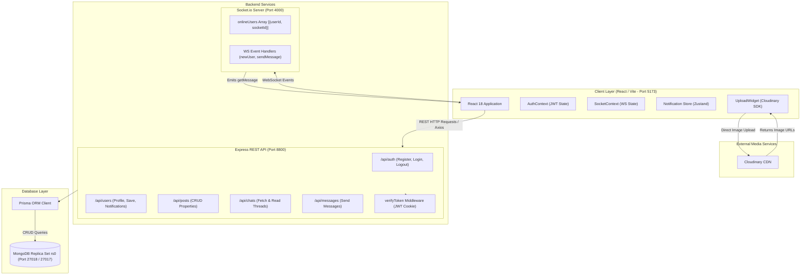
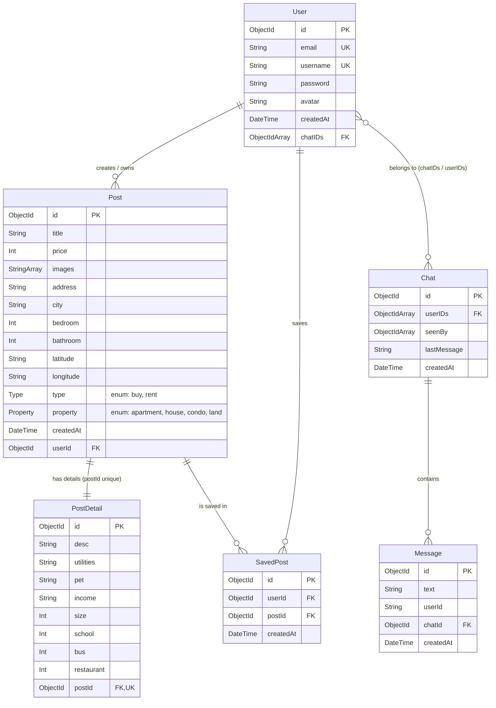
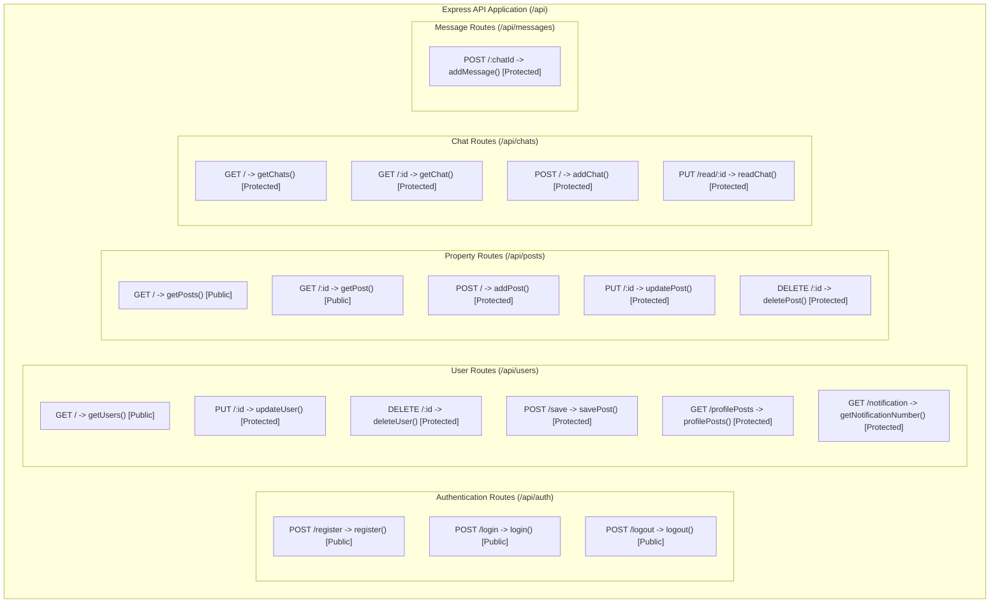
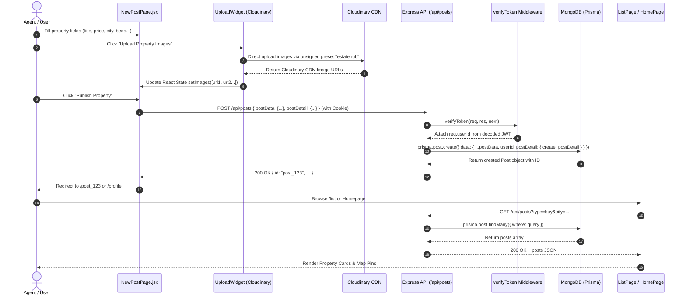
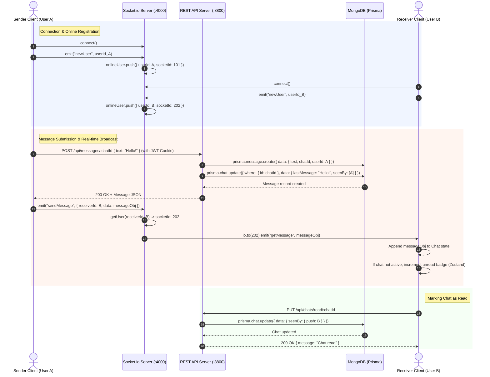
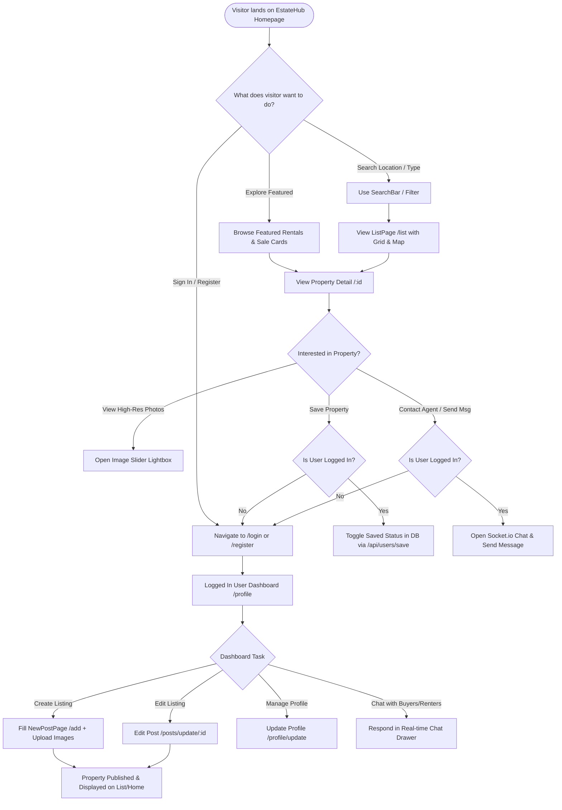

# EstateHub — Technical System Architecture & Diagrams Document

This document provides a comprehensive technical overview of the **EstateHub** real estate application. All diagrams, schemas, sequence flows, and component hierarchies are derived directly from the active project source code across the `client`, `api`, `socket`, and `prisma/schema.prisma` modules.

---

## Table of Contents
1. [System Architecture Diagram](#1-system-architecture-diagram)
2. [Entity-Relationship (ER) Diagram](#2-entity-relationship-er-diagram)
3. [API Route Map](#3-api-route-map)
4. [Authentication Flow (Sequence Diagram)](#4-authentication-flow-sequence-diagram)
5. [Property Listing Flow (Sequence Diagram)](#5-property-listing-flow-sequence-diagram)
6. [Real-Time Chat Flow (Sequence Diagram)](#6-real-time-chat-flow-sequence-diagram)
7. [Frontend Component Tree & Page Structure](#7-frontend-component-tree--page-structure)
8. [User Journey Flowchart](#8-user-journey-flowchart)

---

## 1. System Architecture Diagram

### Overview
The system architecture of EstateHub uses a decoupled three-tier architecture:
- **Frontend (Client)**: Built with React 18 and Vite (`http://localhost:5173`), utilizing Tailwind CSS, React Router v6, Axios REST client, Socket.io-client, and Cloudinary Upload Widget.
- **Backend REST API**: Built with Node.js and Express (`http://localhost:8800`), connecting to MongoDB via Prisma ORM v5, featuring JWT authentication stored in `httpOnly` HTTP cookies.
- **Real-Time WebSocket Server**: Built with Node.js and Socket.io (`ws://localhost:4000`), managing online user sockets and routing peer-to-peer real-time chat messages.
- **Database Layer**: MongoDB Single-Node Replica Set (`rs0` on port `27018` or `27017`), handling document transactions and relational modeling via Prisma.
- **External CDN**: Cloudinary Media Server handling unsigned direct image uploads from the client browser.



**Key Source Files**: `client/src/lib/apiRequest.js`, `socket/app.js`, `api/app.js`, `api/lib/prisma.js`, `client/src/components/uploadWidget/UploadWidget.jsx`.

---

## 2. Entity-Relationship (ER) Diagram

### Overview
EstateHub uses 6 main models defined in `api/prisma/schema.prisma`:
1. `User`: Account entity storing credentials, email, username, avatar image, and `chatIDs` relation.
2. `Post`: Core real estate property entity storing pricing, beds/baths, coordinates (`latitude`, `longitude`), `type` (`buy` | `rent`), `property` (`apartment` | `house` | `condo` | `land`), and owner relation `userId`.
3. `PostDetail`: 1-to-1 extension of `Post` storing description (`desc`), square footage (`size`), policies (`utilities`, `pet`, `income`), and nearby distances (`school`, `bus`, `restaurant`).
4. `SavedPost`: Junction collection establishing a Many-to-Many relation between `User` and `Post` with a compound unique index `[userId, postId]`.
5. `Chat`: Conversation thread between multiple users storing `userIDs`, `seenBy` user arrays, and `lastMessage`.
6. `Message`: Individual text message referencing `chatId` and `userId`.



**Key Source Files**: `api/prisma/schema.prisma`.

---

## 3. API Route Map

### Overview
All REST endpoints are exposed under `/api` in `api/app.js` and protected where appropriate using the `verifyToken` middleware (`api/middleware/verifyToken.js`), which verifies the `token` cookie containing the signed JWT payload.

| Route Group | HTTP Method | Endpoint Path | Controller Function | Access Level | Description |
|---|---|---|---|---|---|
| **Auth** | `POST` | `/api/auth/register` | `register()` | Public | Hashes password via `bcrypt` and creates User |
| **Auth** | `POST` | `/api/auth/login` | `login()` | Public | Authenticates user, signs JWT, sets `token` HttpOnly cookie |
| **Auth** | `POST` | `/api/auth/logout` | `logout()` | Public | Clears `token` cookie |
| **Users** | `GET` | `/api/users/` | `getUsers()` | Public | Lists all users |
| **Users** | `PUT` | `/api/users/:id` | `updateUser()` | Protected | Updates user username, email, password, or avatar |
| **Users** | `DELETE` | `/api/users/:id` | `deleteUser()` | Protected | Deletes user account |
| **Users** | `POST` | `/api/users/save` | `savePost()` | Protected | Toggles saving/unsaving a property for current user |
| **Users** | `GET` | `/api/users/profilePosts` | `profilePosts()` | Protected | Fetches user's created listings and saved listings |
| **Users** | `GET` | `/api/users/notification` | `getNotificationNumber()`| Protected | Counts unread chats for badge notification |
| **Posts** | `GET` | `/api/posts/` | `getPosts()` | Public | Fetches filtered properties (type, city, price range, beds) |
| **Posts** | `GET` | `/api/posts/:id` | `getPost()` | Public | Fetches single property detail with owner info |
| **Posts** | `POST` | `/api/posts/` | `addPost()` | Protected | Creates new property post and nested PostDetail |
| **Posts** | `PUT` | `/api/posts/:id` | `updatePost()` | Protected | Updates property post and PostDetail attributes |
| **Posts** | `DELETE` | `/api/posts/:id` | `deletePost()` | Protected | Deletes post owned by current user |
| **Chats** | `GET` | `/api/chats/` | `getChats()` | Protected | Fetches all chat threads for logged in user |
| **Chats** | `GET` | `/api/chats/:id` | `getChat()` | Protected | Fetches chat messages and marks thread as read |
| **Chats** | `POST` | `/api/chats/` | `addChat()` | Protected | Initiates new chat thread between users |
| **Chats** | `PUT` | `/api/chats/read/:id` | `readChat()` | Protected | Adds current user ID to `seenBy` array |
| **Messages** | `POST` | `/api/messages/:chatId` | `addMessage()` | Protected | Appends text message to chat and updates `lastMessage` |



**Key Source Files**: `api/app.js`, `api/routes/*.js`, `api/middleware/verifyToken.js`.

---

## 4. Authentication Flow (Sequence Diagram)

### Overview
This sequence diagram documents the complete user registration, authentication, JWT cookie generation, and protected route authorization lifecycle.

```mermaid
sequenceDiagram
    autonumber
    actor User as User (Browser)
    participant Client as React Client (Login.jsx)
    participant API as Express API (/api/auth)
    participant DB as MongoDB (Prisma)
    participant Context as AuthContext

    %% Registration Sub-flow
    rect rgb(240, 245, 255)
        note right of User: User Registration Flow
        User->>Client: Submit Form (username, email, password)
        Client->>API: POST /api/auth/register { username, email, password }
        API->>API: bcrypt.hash(password, 10)
        API->>DB: prisma.user.create({ data: { username, email, password: hashedPassword } })
        DB-->>API: User record created
        API-->>Client: 201 Created { message: "User created successfully" }
        Client-->>User: Redirect to /login
    end

    %% Login Sub-flow
    rect rgb(255, 245, 240)
        note right of User: User Login & Cookie Token Flow
        User->>Client: Submit Credentials (username, password)
        Client->>API: POST /api/auth/login { username, password }
        API->>DB: prisma.user.findUnique({ where: { username } })
        DB-->>API: User record (including hashedPassword)
        API->>API: bcrypt.compare(password, user.password)
        API->>API: jwt.sign({ id: user.id }, JWT_SECRET_KEY, { expiresIn: 7 days })
        API-->>Client: 200 OK + Set-Cookie: token=<JWT>; HttpOnly + JSON userInfo
        Client->>Context: updateUser(userInfo)
        Client-->>User: Redirect to Homepage / Dashboard
    end

    %% Protected Route Access
    rect rgb(245, 255, 245)
        note right of User: Protected Route Request
        User->>Client: Navigate to /profile or /add
        Client->>API: GET /api/users/profilePosts (Cookie: token=<JWT>)
        API->>API: verifyToken middleware -> jwt.verify(token, JWT_SECRET_KEY)
        API->>DB: Fetch protected data for req.userId
        DB-->>API: User listings & saved posts
        API-->>Client: 200 OK + Data
        Client-->>User: Render Dashboard UI
    end
```

**Key Source Files**: `client/src/routes/login/login.jsx`, `api/controllers/auth.controllers.js`, `api/middleware/verifyToken.js`, `client/src/context/AuthContext.jsx`.

---

## 5. Property Listing Flow (Sequence Diagram)

### Overview
This sequence diagram details the process of creating a new property post: uploading high-res photos directly to Cloudinary, sending form payload to `/api/posts`, saving nested documents in MongoDB, and rendering property cards & Leaflet map markers.



**Key Source Files**: `client/src/routes/newPostPage/newPostPage.jsx`, `client/src/components/uploadWidget/UploadWidget.jsx`, `api/controllers/post.controller.js`, `client/src/routes/listPage/listPage.jsx`.

---

## 6. Real-Time Chat Flow (Sequence Diagram)

### Overview
EstateHub employs a dual-track messaging workflow:
1. **HTTP REST Track**: Saves text message records to MongoDB via Express (`/api/messages/:chatId`) and updates `lastMessage` and `seenBy` array fields.
2. **WebSocket Track**: Broadcasts the message payload in real time to the receiver's socket ID via Socket.io server (`:4000`), triggering UI state updates and Zustand notification badge increments.



**Key Source Files**: `client/src/components/chat/Chat.jsx`, `api/controllers/message.controller.js`, `socket/app.js`, `client/src/lib/notificationStore.js`.

---

## 7. Frontend Component Tree & Page Structure

### Overview
This diagram shows the React component hierarchy managed by React Router v6 in `client/src/App.jsx`. Layout containers (`<Layout />` and `<RequireAuth />`) inject standard shared components (`Navbar`, `Footer`) around outlet views.



```mermaid
graph TD
    App["App.jsx (createBrowserRouter)"]

    subgraph PublicLayout ["Public Layout (<Layout />)"]
        Navbar1["Navbar.jsx"]
        Outlet1["<Outlet />"]
        Footer1["Footer.jsx"]

        P_Home["HomePage.jsx"]
        P_List["ListPage.jsx"]
        P_Single["SinglePage.jsx"]
        P_Login["Login.jsx"]
        P_Reg["Register.jsx"]
    end

    subgraph ProtectedLayout ["Protected Layout (<RequireAuth />)"]
        Navbar2["Navbar.jsx"]
        Outlet2["<Outlet />"]

        P_Profile["ProfilePage.jsx"]
        P_ProfUpdate["ProfileUpdatePage.jsx"]
        P_NewPost["NewPostPage.jsx"]
        P_UpdatePost["UpdatePostPage.jsx"]
    end

    subgraph SharedComponents ["Shared UI Components"]
        C_Card["Card.jsx"]
        C_Filter["Filter.jsx"]
        C_SearchBar["SearchBar.jsx"]
        C_Map["Map.jsx"]
        C_Pin["Pin.jsx"]
        C_Slider["Slider.jsx"]
        C_Chat["Chat.jsx"]
        C_Upload["UploadWidget.jsx"]
        C_List["List.jsx"]
        C_Notif["Notification.jsx"]
    end

    %% Router Mapping
    App --> PublicLayout
    App --> ProtectedLayout

    PublicLayout --> Navbar1
    PublicLayout --> Outlet1
    PublicLayout --> Footer1

    ProtectedLayout --> Navbar2
    ProtectedLayout --> Outlet2

    %% Page to Component Dependencies
    P_Home --> C_SearchBar
    P_Home --> C_List
    P_Home --> C_Footer1

    P_List --> C_Filter
    P_List --> C_Card
    P_List --> C_Map
    C_Map --> C_Pin

    P_Single --> C_Slider
    P_Single --> C_Map

    P_Login --> C_Notif

    P_Profile --> C_List
    P_Profile --> C_Chat
    C_List --> C_Card

    P_ProfUpdate --> C_Upload
    P_NewPost --> C_Upload
    P_UpdatePost --> C_Upload
```

**Key Source Files**: `client/src/App.jsx`, `client/src/routes/layout/layout.jsx`, `client/src/components/*`.

---

## 8. User Journey Flowchart

### Overview
This flowchart depicts the main visitor navigation paths, authorization check triggers, and user dashboard management flows.



**Key Source Files**: `client/src/App.jsx`, `client/src/routes/homePage/homePage.jsx`, `client/src/routes/singlePage/singlePage.jsx`.
